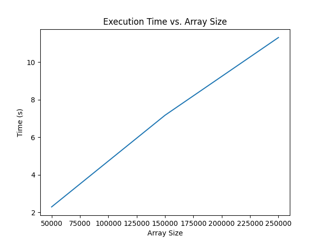
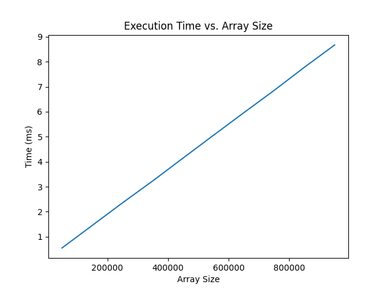

# Párhuzamos eszközök programozása repository

## Féléves beadandó feladat: *Prím szorzat felbontás*


## Futtatás
A program futtatásához szükséges az OpenCL SDK valamint a python legfrissebb verziója amelyben telepítve vannak a *pyopencl* ,*numpy* valamint *matplotlib* csomagok.

## Feladat leírása
A féléves feladatom véletlenszerű számok prím tényezős felbontása köré épül. <br/>
A probléma méretét a felbontandó számok száma valamint a számok nagysága is befolyásolja:

```sizes  =  range(50000, max_size  +  1, step)```

A program main függvényében létrehozásra kerül a  számokat tartalmazó tömb, ami a következőképpen kerül deklarálásra: 
``` input_array  =  np.random.randint(1, 1025, size=size).astype(np.int32)```

## CPU végrehajtás
A CPU-s futás idő mérése során a prím tényezős felbontást egy külön metódus valósítja meg. Ennek a metódusnak a meghívása előtt lekérem az időt valamint a futás után is lekérek egy időt és a kettő különbségének számításával kapom meg hogy a program mennyi ideig volt az adott eljárásban. A program ezután a számított times és sizes tömbökből diagramot készít a futási időre vonatkozólag.  

## GPU végrehajtás
A GPU-s végrehajtás esetén is a fenti módon került inicializálásra a kezdeti input array. A program az elején lekéri a platformokat és a hozzájuk tartozó eszközöket:  
```platforms  =  cl.get_platforms()```
``` devices  =  platform.get_devices()```
Ezután erre a platformra létrehoz egy context-et:
``` context  =  cl.Context(properties=[(cl.context_properties.PLATFORM, platform)])```
majd erre a context-re egy CommandQueue kerül létrehozásra:
``` queue  =  cl.CommandQueue(context, properties=cl.command_queue_properties.PROFILING_ENABLE)```
A CommandQueue létrehozásakor engedélyezzük a profiling-et a cl.command_queue_properties.PROFILING_ENABLE flag segítségével, ezt követően lefoglaljuk a szükséges memória területeket, először az input buffer számára:
```input_buffer  =  cl.Buffer(context, cl.mem_flags.READ_ONLY |  cl.mem_flags.COPY_HOST_PTR, hostbuf=input_array)```
Majd ezt követően az output buffer számára: 
```factors_buffer  =  cl.Buffer(context, cl.mem_flags.WRITE_ONLY, factors.nbytes)```
A programot a 
```program  =  cl.Program(context, kernel_code).build()```
sorral tudjuk buildelni majd a 
```event  =  program.prime_factors(queue, input_array.shape, None, input_buffer, factors_buffer, np.uint32(n)) ```
sorral futtatni a 
```queue.finish()``` 
futtatásával a program befejeződik és bezárul a kernel.
## Futási idők
A program futási ideje a következőképp alakul:



Az ábrákom jól látható hogy a program mindkét esetben közel linárisan növekvő futási időt mutat, és amíg a CPU-s változat 250.000-es tömb méret esetén már több mint 10 másodperces futási időt mutat, addig a GPU-s változat 800.000 tömb elem esetén is mindössze pár milisecond alatt fut le.